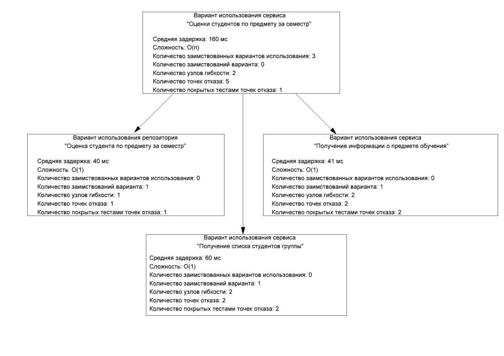
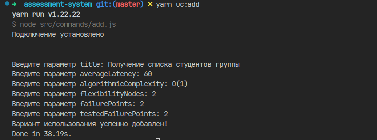
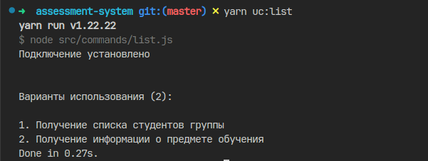
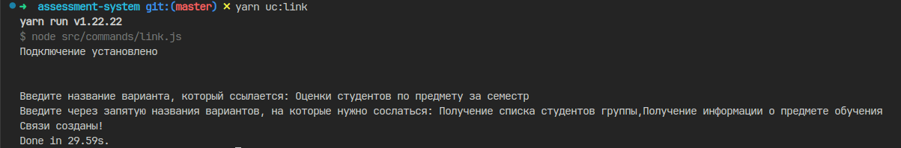
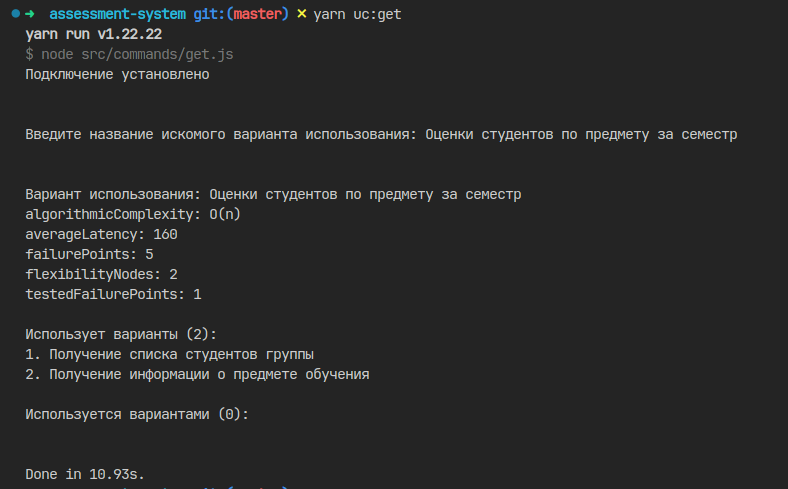

# Консольная утилита для организации графа вариантов использования с показателями

Реализована на Node.js 18.\*, Neo4j 5.20.0.



## Конфигурация для запуска на Linux

1. Запуск Neo4j через Docker

```shell
docker run \
    --publish=7474:7474 --publish=7687:7687 \
    --volume=$HOME/neo4j/data:/data \
    neo4j
```

2. Установка зависимостей

```shell
npm install
```

или

```shell
yarn install
```

3. Конфигурация переменных среды

```shell
cp .env.example .env
```

## Команды

Далее uc = use cases = варианты использования.

Команды запускаются через npm или yarn.

```shell
npm run uc:list
```

что эквивалентно

```shell
yarn uc:list
```

### Добавление варианта использования

Схема показателей определяется в [этом файле](src/schema.js)



```shell
yarn uc:add
```

### Получение списка вариантов использования



```shell
yarn uc:list
```

### Связывание вариантов использования



```shell
yarn uc:link
```

### Получение полной информации по одиночному варианту использования



```shell
yarn uc:get
```
